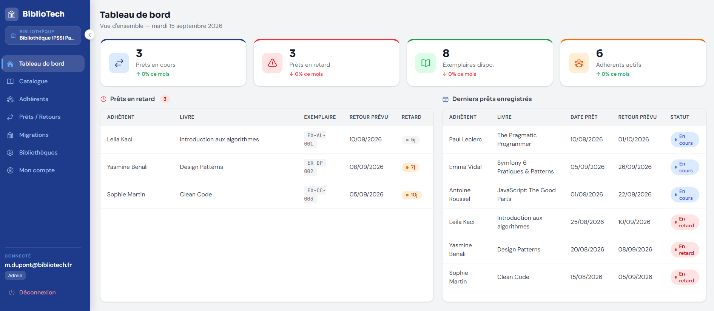
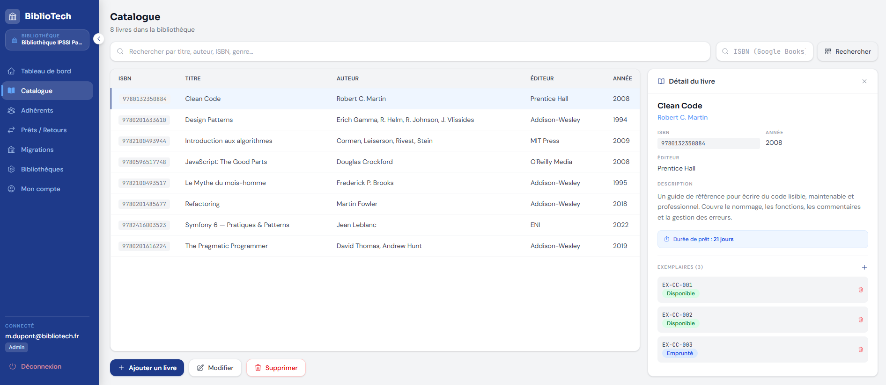
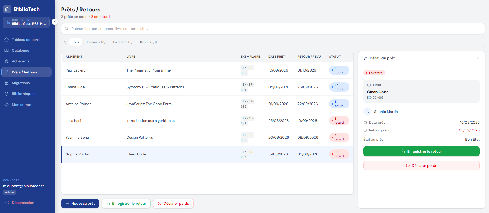
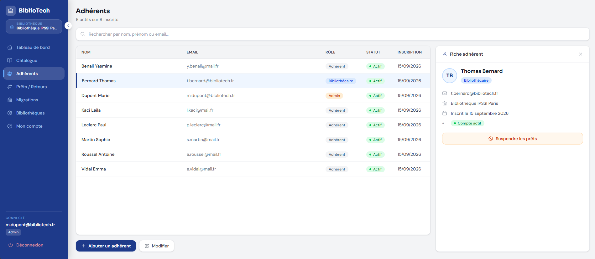
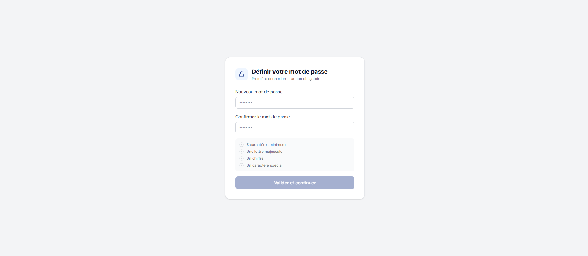
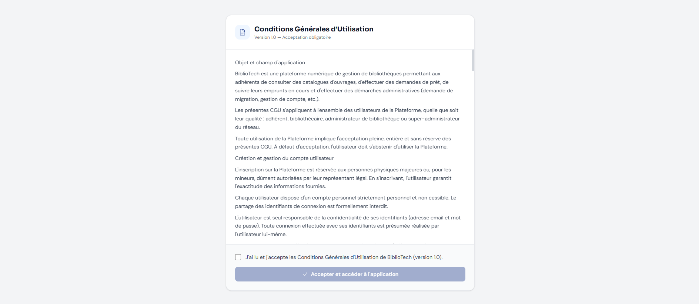

# Jalon 2 – Méthodologie & Conception UI/UX

**Projet :** BiblioTech Desktop
**Auteur :** Grégory Sergent
**Formation :** CDA – Concepteur Développeur d'Applications
**Période :** Janvier → Juin 2026
**Date :** 28/02/2026

---

## Sommaire

1. Méthodologie et organisation du projet
   - 1.1 Méthode de gestion (Agile/Scrum adapté)
   - 1.2 Macro-planning (janvier → juin 2026)
   - 1.3 Suivi des tâches (Trello)
   - 1.4 Gestion du code source (Git)
   - 1.5 CI/CD planifié
2. Conception UI/UX
   - 2.1 Sitemap
   - 2.2 Zoning
   - 2.3 Wireframes (basse fidélité)
   - 2.4 Charte graphique
   - 2.5 Maquettes graphiques (haute fidélité)
   - 2.6 Considérations UX

---

## Partie 1 – Méthodologie et organisation du projet

### 1.1 Méthode de gestion

**Approche choisie : Agile – Scrum adapté en solo.**

- **Cadence :** 1 sprint par mois (aligné sur les jalons).
- **Définition :** un *sprint* est une période courte et fixe durant laquelle on réalise un lot d'objectifs précis.
- **Rituels adaptés :**
  - **Sprint planning mensuel** : définition des objectifs du jalon + découpage en tâches.
  - **Revue hebdomadaire** : contrôle de l'avancement, mise à jour du backlog Trello.
  - **Rétrospective mensuelle** : bilan des difficultés/solutions et ajustements.
- **Justification :** ce format léger garde un cadre clair tout en restant réaliste pour un travail en solo.

### 1.2 Macro-planning (jusqu'à juin 2026)

- **Janvier** : Cadrage fonctionnel – livrable : CDCF (Jalon 1)
- **Février** : Organisation & design UI/UX – livrable : Méthodologie + maquettes (Jalon 2)
- **Mars** : Conception des données – livrable : MCD/MLD/MPD + dictionnaire (Jalon 3)
- **Avril** : Conception applicative & architecture – livrable : UML + archi (Jalon 4)
- **Mai** : Implémentation + sécurité + tests – livrable : Version bêta + preuves CI + tests (Jalon 5)
- **Juin** : Déploiement & finalisation – livrable : Livraison finale + mise en prod (Jalon 6)

### 1.3 Suivi des tâches

**Outil :** Trello (Kanban)

- Colonnes : *Backlog* → *À faire* → *En cours* → *En revue* → *Terminé*
- **Rythme :** mise à jour hebdomadaire, ajustement du backlog à chaque sprint planning.
- **Traçabilité :** chaque carte correspond à une user story ou tâche technique, avec checklist si besoin.

### 1.4 Gestion du code source (Git)

- **Branches :**
  - `main` : versions stables (jalons)
  - `develop` : intégration continue
  - `feature/*` : nouvelles fonctionnalités ou correctifs
- **Process :** PR systématique vers `develop` (auto-revue avant merge).
- **Conventions :** commits courts et explicites (ex. `feat: isbn lookup`, `fix: loan return status`).

### 1.5 CI/CD planifié

**CI (objectif si le temps le permet)**

- **Cible : GitHub Actions**
- À chaque push (objectif) :
  - Tests PHP (PHPUnit) pour l'API Symfony
  - Lint/format (PHP-CS-Fixer / ESLint)
  - Build front React
  - Build Docker (API)
- **Plan B si manque de temps :** exécuter les tests et le build localement avant chaque jalon, avec checklist documentée.

**CD (à partir de mai/juin)**

- Publication d'images Docker (API) vers Docker Hub ou GHCR
- Build desktop Tauri (Windows) via pipeline CI ou en local si nécessaire
- Livraison du binaire `*.exe` en artefact release

---

## Partie 2 – Conception UI/UX

### 2.1 Sitemap (écrans principaux)

Le sitemap ci-dessous présente l'ensemble des écrans de l'application BiblioTech Desktop et les liens de navigation entre eux.

- **Authentification**
  - Connexion
- **Tableau de bord**
  - Vue synthétique (prêts en retard + statistiques)
- **Catalogue**
  - Liste des livres
  - Détail d'un livre
  - Ajout / Édition d'un livre
- **Adhérents**
  - Liste des adhérents
  - Détail d'un adhérent
  - Ajout / Édition d'un adhérent
- **Prêts / Retours**
  - Création d'un prêt
  - Liste des prêts (tableau + barre de recherche)
  - Retour d'un livre

### 2.2 Zoning (écran type)

**Desktop – Écran "Authentification"**
- Zone centrale : Formulaire de connexion (identifiant + mot de passe)
- Zone inférieure / action : Bouton de connexion

**Desktop – Écran "Tableau de bord"**
- Navbar : Navigation principale
- Zone statistiques : Cartes de statistiques de prêt (nb prêts en cours, retards, etc.)
- Zone tableau 1 : Tableau des prêts en retard
- Zone tableau 2 : Tableau des derniers prêts

**Desktop – Écran "Catalogue"**
- Navbar : Navigation principale
- Zone recherche : Barre de recherche
- Zone tableau : Liste des livres
- Zone détail : Détails du livre sélectionné
- Zone actions : Boutons d'ajout et d'édition de livre

**Desktop – Écran "Adhérents"**
- Navbar : Navigation principale
- Zone recherche : Barre de recherche
- Zone liste : Liste des adhérents
- Zone détail : Détails de l'adhérent sélectionné
- Zone actions : Boutons d'ajout, d'édition et de suppression d'adhérent

**Desktop – Écran "Prêts / Retours"**
- Navbar : Navigation principale
- Zone recherche : Barre de recherche
- Zone liste : Liste des prêts en cours
- Zone détail : Détails du prêt sélectionné
- Zone actions : Boutons "Créer un prêt" et "Rendre un prêt"

### 2.3 Wireframes (basse fidélité)

**A) Desktop – Authentification**
- Logo de l'application (haut droite)
- 2 labels (identifiant, mot de passe)
- 2 champs de saisie
- 1 bouton de connexion

**B) Desktop – Tableau de bord**
- Navbar gauche : liste de navigation + bouton déconnexion
- Zone stats (haut) : 3 blocs de statistiques
- 2 tableaux liste en dessous (prêts en retard + derniers prêts)

**C) Desktop – Catalogue**
- Navbar gauche : liste de navigation + bouton déconnexion
- Barre de recherche (haut de l'écran)
- Tableau liste des livres
- Zone détail du livre sélectionné (à droite du tableau)
- 2 boutons sous le tableau : édition + ajout d'un livre

**D) Desktop – Adhérents**
- Navbar gauche : liste de navigation + bouton déconnexion
- Barre de recherche (haut de l'écran)
- Tableau liste des adhérents
- Zone détail de l'adhérent sélectionné (à droite du tableau)
- 3 boutons sous le tableau : ajout + édition + suppression d'un adhérent

**E) Desktop – Prêts / Retours**
- Navbar gauche : liste de navigation + bouton déconnexion
- Barre de recherche (haut de l'écran)
- Tableau liste des prêts en cours
- Zone détail du prêt sélectionné (à droite du tableau)
- 2 boutons sous le tableau : créer un prêt + rendre un prêt

### 2.4 Charte graphique

#### Palette de couleurs

- Primaire : Bleu nuit – `#1E3A8A`
- Secondaire : Bleu clair – `#60A5FA`
- Accent / Validation : Vert – `#16A34A`
- Neutre clair : Gris clair – `#F3F4F6`
- Neutre foncé : Gris foncé – `#374151`

**Justification :** le bleu nuit inspire confiance et sérieux, adapté à un outil professionnel interne. Le vert est réservé aux actions de validation pour un feedback visuel immédiat.

#### Typographie

- Titre principal (H1) : **Sora** – Bold – 28px
- Titres de section (H2/H3) : **Sora** – SemiBold – 20px / 16px
- Texte courant : **DM Sans** – Regular – 14px
- Labels / libellés : **DM Sans** – Medium – 13px
- Légendes / métadonnées : **DM Sans** – Regular – 12px
- Code / ISBN : **JetBrains Mono** – Regular – 13px

**Justification :**
- **Sora** – police géométrique moderne pour les titres, contemporaine et professionnelle.
- **DM Sans** – conçue pour les interfaces numériques, très lisible à petite taille, idéale pour tableaux et formulaires.
- **JetBrains Mono** – réservée aux identifiants techniques (ISBN, codes) pour les distinguer du reste du contenu.

#### Style général

- Icônes linéaires : **Heroicons**
- Espacements généreux pour maximiser la lisibilité
- Interface sobre et professionnelle, sans effets décoratifs superflus

### 2.5 Maquettes graphiques (haute fidélité)

#### Version Desktop – Tableau de bord

#### Version Mobile – Liste du catalogue

### 2.6 Considérations UX

- **Scan ISBN :** ajout d'un livre en moins de 5 secondes via scan ou saisie manuelle.
- **Feedback visuel :** messages de confirmation/erreur clairs sur chaque action critique (prêt validé, ISBN invalide, adhérent introuvable).
- **Accessibilité :** contrastes élevés conformes aux recommandations WCAG, navigation clavier complète.
- **Performance :** listes paginées pour éviter les temps de chargement excessifs même avec un grand catalogue.
- **Mobile First :** l'interface s'adapte à des résolutions réduites, avec des zones tactiles suffisamment grandes.