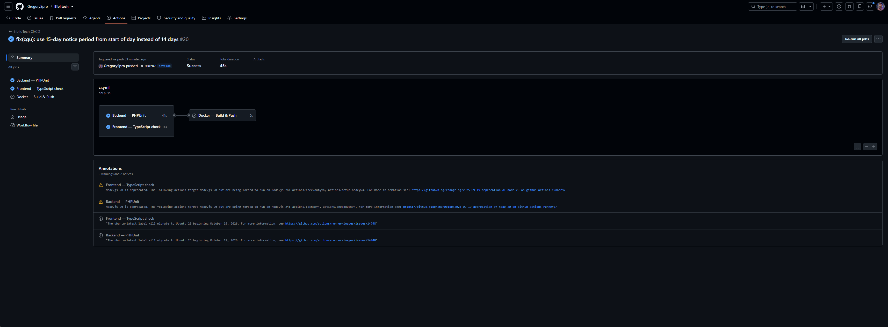
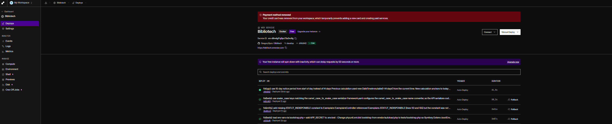
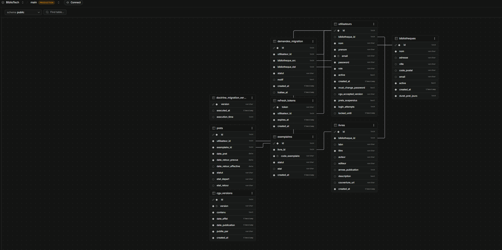

# Jalon 6 – Déploiement, Sécurité & Mise en Production

**Projet :** BiblioTech
**Auteur :** Grégory Sergent
**Organisme de formation :** IPSSI Grande École d'Informatique
**Formation :** CDA – Concepteur Développeur d'Applications
**Période :** Janvier → Juillet 2026
**Date :** 6 juillet 2026
**Statut :** Version finale 1.0

---

## Sommaire

1. Introduction
2. Audit de sécurité — synthèse
   - 2.1 Périmètre audité
   - 2.2 Vulnérabilités corrigées
   - 2.3 Risques résiduels documentés
3. Correctifs appliqués (Jalon 6)
4. Infrastructure & Docker
   - 4.1 Architecture des conteneurs
   - 4.2 Dockerfile backend
   - 4.3 Dockerfile frontend
   - 4.4 Docker Compose final
5. CI/CD — Pipeline GitHub Actions
   - 5.1 Structure de la pipeline
   - 5.2 Job backend (PHPUnit)
   - 5.3 Job frontend (TypeScript check)
   - 5.4 Job Docker Build & Push (releases)
6. Instructions de déploiement
   - 6.1 Prérequis
   - 6.2 Déploiement local (développement)
   - 6.3 Déploiement production
   - 6.4 Variables d'environnement de production
7. Stratégie de mise en production
8. Conformité RGPD
9. Bilan des tests
10. Bilan global & perspectives

---

## 1) Introduction

Ce livrable constitue le **Jalon 6 et livrable final** du projet BiblioTech. Il couvre les thèmes imposés par le CDC pour la phase de déploiement et mise en production : audit de sécurité complet, pipeline CI/CD, conteneurisation finale et instructions de déploiement.

**Tag Git release :** `v1.0.0` — posé sur `main` après merge de `develop`.

### Rappel des jalons précédents

| Jalon | Mois | Contenu |
|---|---|---|
| Jalon 1 | Janvier 2026 | Cahier des charges fonctionnel |
| Jalon 2 | Février 2026 | Méthodologie & conception UI/UX |
| Jalon 3 | Mars 2026 | Modélisation BD (MCD, MLD, MPD) |
| Jalon 4 | Avril 2026 | Conception UML & architecture technique |
| Jalon 5 | Mai/Juin 2026 | Développement complet, sécurité, tests (version bêta) |
| **Jalon 6** | **Juillet 2026** | **Déploiement, audit sécurité, CI/CD, livrable final** |

### Ce que couvre le Jalon 6

- **Audit de sécurité approfondi** : scan complet de l'ensemble du code source, identification et correction de 14 vulnérabilités
- **Mise en place du pipeline CI/CD** via GitHub Actions (tests automatiques + build Docker sur release)
- **Finalisation de l'infrastructure Docker** (Dockerfile frontend manquant, corrections docker-compose)
- **Documentation de déploiement** : procédure complète du clone Git jusqu'à la mise en production
- **Registre RGPD Article 30** : 4 traitements de données documentés

---

## 2) Audit de sécurité — synthèse

### 2.1 Périmètre audité

L'audit a couvert l'intégralité du code source :

| Périmètre | Fichiers analysés |
|---|---|
| Controllers Symfony | AuthController, BibliothequeController, CguController, DemandeMigrationController, ExemplaireController, LivreController, PretController, StatController, UtilisateurController |
| Entités & Services | Utilisateur, Bibliotheque, Livre, Exemplaire, Pret, RefreshToken, CguVersion, PretService, GoogleBooksService |
| Frontend React | AuthContext, ProtectedRoute, MonComptePage, PremierLoginMotDePassePage, PremierLoginCguPage, CguContext, services API |
| Infrastructure | docker-compose.yml, Dockerfiles, security.yaml, framework.yaml, lexik_jwt.yaml |

### 2.2 Vulnérabilités corrigées (14 au total)

| Code | Sévérité | OWASP | Description | Statut |
|---|---|---|---|---|
| CVE-B01 | Critique | A04 | Crash PHP sur `PretController::retour()` — variable `$request` non injectée | ✅ Corrigé |
| CVE-B02 | Haute | A01 | Exposition de toutes les bibliothèques à tout utilisateur authentifié | ✅ Corrigé |
| CVE-B03 | Haute | A01 | Élévation de privilège à la création d'utilisateur (admin pouvait créer super_admin) | ✅ Corrigé |
| CVE-B04 | Haute | A07 | Validation de force du mot de passe absente sur 2 endpoints | ✅ Corrigé |
| CVE-B05 | Haute | A01 | Absence de validation de version CGU côté serveur | ✅ Corrigé |
| CVE-B06 | Haute | A01 | Isolation multi-tenant absente sur prêts (create + retour) | ✅ Corrigé |
| CVE-B08 | Moyenne | A07 | Rate Limiter Symfony configuré mais non connecté à AuthController | ✅ Corrigé |
| CVE-B09 | Haute | A01 | 4 méthodes UtilisateurController sans contrôle bibliotheque_id | ✅ Corrigé |
| CVE-B10 | Moyenne | A07 | Validation mot de passe absente dans `update()` et `create()` | ✅ Corrigé |
| CVE-B11 | Moyenne | A01 | Endpoint `byEmail` accessible aux adhérents (exposition RGPD) | ✅ Corrigé |
| CVE-B12 | Moyenne | A08 | Statut exemplaire non validé — corruption d'état métier possible | ✅ Corrigé |
| CVE-B13 | Moyenne | A01 | Isolation multi-tenant absente sur `PretController::show()` et `byAdherent()` | ✅ Corrigé |
| CVE-B14 | Haute | A07 | Auto-modification de mot de passe sans vérification du mot de passe actuel | ✅ Corrigé |
| BUG-01 | — | — | Champ `mot_de_passe` vs `password` dans MonComptePage (changement MDP silencieusement ignoré) | ✅ Corrigé |

> Document complet : [`conception/SECURITY_NOTE.md`](./SECURITY_NOTE.md)

### 2.3 Risques résiduels documentés (acceptés)

| Risque | Justification |
|---|---|
| Enforcement `must_change_password` côté frontend uniquement | SPA React/Vite — accès uniquement depuis l'interface authentifiée. Mitigation : la logique est vérifiée à chaque navigation dans `ProtectedRoute`. Amélioration future : kernel event listener Symfony. |
| JWT non invalidé sur logout | Pattern stateless standard JWT. Le refresh token (vecteur de session longue) est bien invalidé. TTL access token : 8h. |
| Tokens JWT dans `localStorage` | Risque faible dans le contexte d'une SPA sans contenus tiers dynamiques injectés. Amélioration possible : migration vers cookies `HttpOnly` + `SameSite=Strict`. |

---

## 3) Correctifs appliqués (Jalon 6)

### 3.1 Backend

**`UtilisateurController.php`** — 6 correctifs de sécurité :

| Méthode | Correctif |
|---|---|
| `show()` | Isolation multi-tenant : admin/bibliothécaire limités à leur bibliothèque |
| `update()` | Isolation multi-tenant + validation mot de passe + `current_password` requis sur auto-modification |
| `delete()` | Isolation multi-tenant admin |
| `suspendrePrets()` | Isolation multi-tenant admin |
| `byEmail()` | Restriction aux rôles staff (bibliothecaire minimum) |
| `create()` | Validation force du mot de passe ajoutée |

**`PretController.php`** — 2 correctifs :

| Méthode | Correctif |
|---|---|
| `show()` | Isolation multi-tenant : staff limité à sa bibliothèque |
| `byAdherent()` | Isolation multi-tenant : staff limité à sa bibliothèque |

**`ExemplaireController.php`** — 1 correctif :
- Validation whitelist statut (`create()` + `update()`) : seuls `disponible`, `emprunte`, `indisponible` acceptés

**`AuthController.php`** — 1 correctif :
- Injection et connexion effective du `RateLimiterFactory` avec `#[Target('loginIp')]`

### 3.2 Frontend

**`MonComptePage.tsx`** :
- Correction du champ `mot_de_passe` → `password` (le changement de mot de passe en profil échouait silencieusement)

---

## 4) Infrastructure & Docker

### 4.1 Architecture des conteneurs

```
┌─────────────────────────────────────────────────────┐
│                  Réseau: bibliotech_net              │
│                                                     │
│  ┌──────────────┐  ┌──────────────┐  ┌───────────┐ │
│  │   frontend   │  │     app      │  │    db     │ │
│  │  React/Vite  │  │  Symfony/PHP │  │ Postgres  │ │
│  │  :5173       │─▶│  :80/:8080   │─▶│ :5432     │ │
│  │  Node 20     │  │  PHP 8.3     │  │ v16-alpine│ │
│  └──────────────┘  └──────────────┘  └───────────┘ │
│                                                     │
│  Volume persistant : db_data                        │
└─────────────────────────────────────────────────────┘
```

### 4.2 Dockerfile backend (`dev/backend/Dockerfile`)

Le projet utilise un Dockerfile PHP 8.3-FPM + Apache fourni par Symfony Docker :

```
Symfony PHP 8.3-FPM (caddy ou apache)
├── Extensions PHP : pdo_pgsql, intl, mbstring, opcache
├── Composer install --no-dev en prod
└── Volumes dev : code source monté (hot-reload)
```

### 4.3 Dockerfile frontend (`dev/frontend/Dockerfile`)

Créé lors du Jalon 6 :

```dockerfile
FROM node:20-alpine
WORKDIR /app
COPY package.json package-lock.json* ./
RUN npm ci
COPY . .
EXPOSE 5173
CMD ["npm", "run", "dev", "--", "--host", "0.0.0.0"]
```

### 4.4 Docker Compose final

Fichier : `dev/docker/docker-compose.yml`

Correctifs appliqués lors du Jalon 6 :
- Chemins `context` et `volumes` corrigés (`./backend` → `../backend`, `./frontend` → `../frontend`)
- Ajout du service `frontend` avec le Dockerfile nouvellement créé

```yaml
services:
  app:       # Symfony PHP — port 8080
  db:        # PostgreSQL 16 — port 5432
  frontend:  # React/Vite — port 5173
```

---

## 5) CI/CD — Pipeline GitHub Actions

Fichier : `.github/workflows/ci.yml`

### 5.1 Structure de la pipeline

```
push / pull_request
    │
    ├── backend-tests  ─── PHPUnit sur PostgreSQL (service container)
    │
    └── frontend-lint  ─── TypeScript tsc --noEmit

tag v*.*.* (release)
    │
    └── docker-build ──── dépend de [backend-tests, frontend-lint]
                    └─── Build & Push images Docker Hub
                         ├── bibliotech-backend:latest + :vX.Y.Z
                         └── bibliotech-frontend:latest + :vX.Y.Z
```

### 5.2 Job backend — PHPUnit

Déclenchement : tout push sur `main` ou `develop`, toute PR.

Étapes :
1. Checkout du code source
2. Setup PHP 8.3 avec extensions `pdo_pgsql`, `intl`, `mbstring`
3. Cache Composer (clé basée sur `composer.lock`)
4. `composer install --no-interaction --prefer-dist`
5. **Génération des clés JWT RSA 4096 bits** pour l'environnement de test
6. Copie de `.env.test` et injection de la `DATABASE_URL` CI
7. `doctrine:database:create --env=test`
8. `doctrine:migrations:migrate --env=test`
9. `doctrine:fixtures:load --env=test`
10. `php bin/phpunit --testdox`

Service PostgreSQL : image `postgres:16-alpine` avec health-check (`pg_isready`).

### 5.3 Job frontend — TypeScript check

Déclenchement : tout push / PR.

Étapes :
1. Checkout
2. Setup Node 20 avec cache npm
3. `npm ci`
4. `npx tsc --noEmit` (vérification des types sans compilation)

### 5.4 Job Docker Build & Push

Déclenchement : uniquement sur les tags `v*.*.*` (ex. `git tag v1.0.0 && git push --tags`).

Prérequis : secrets GitHub configurés :
- `DOCKERHUB_USERNAME` — nom d'utilisateur Docker Hub
- `DOCKERHUB_TOKEN` — token d'accès Docker Hub (Access Token, pas le mot de passe)

Étapes :
1. Checkout
2. Extraction de la version depuis le tag Git
3. Setup Docker Buildx (build multi-arch)
4. Login Docker Hub
5. Build & Push image backend avec tags `:latest` et `:vX.Y.Z`
6. Build & Push image frontend avec tags `:latest` et `:vX.Y.Z`

Les builds sont mis en cache via GitHub Actions Cache (`type=gha`) pour accélérer les exécutions successives.

---

## 6) Instructions de déploiement

### 6.1 Prérequis

| Outil | Version minimale |
|---|---|
| Docker | 24+ |
| Docker Compose | 2.20+ |
| Git | 2.40+ |

### 6.2 Déploiement local (développement)

```bash
# 1. Cloner le dépôt
git clone https://github.com/GregorySpro/bibliotech.git
cd bibliotech

# 2. Créer les variables d'environnement backend
cp dev/backend/.env dev/backend/.env.local
# Éditer .env.local : JWT_PASSPHRASE, GOOGLE_BOOKS_API_KEY, DATABASE_URL

# 3. Générer les clés JWT (une seule fois)
cd dev/backend
mkdir -p config/jwt
openssl genpkey -algorithm RSA -pkeyopt rsa_keygen_bits:4096 \
  -out config/jwt/private.pem -pass pass:<votre_passphrase>
openssl pkey -in config/jwt/private.pem \
  -out config/jwt/public.pem -pubout -passin pass:<votre_passphrase>
cd ../..

# 4. Lancer les conteneurs
cd dev/docker
docker compose up -d

# 5. Initialiser la base de données (première fois)
docker compose exec app php bin/console doctrine:migrations:migrate --no-interaction
docker compose exec app php bin/console doctrine:fixtures:load --no-interaction

# 6. Accès
#   Frontend : http://localhost:5173
#   API      : http://localhost:8080/api
```

**Comptes de test disponibles :**

| Email | Rôle | Mot de passe |
|---|---|---|
| `superadmin@test.fr` | super_admin | `Admin1234!` |
| `admin@test.fr` | admin | `Admin1234!` |
| `bibliothecaire@test.fr` | bibliothecaire | `Biblio1234!` |
| `adherent@test.fr` | adherent | `Adherent1234!` |
| `premier@test.fr` | bibliothecaire | `Temp1234!` *(doit changer son mot de passe au premier login)* |

### 6.3 Déploiement production

La procédure de déploiement production s'appuie sur les images Docker Hub publiées automatiquement par la pipeline CI/CD lors d'un tag de release.

```bash
# Sur le serveur de production

# 1. Créer le répertoire de déploiement
mkdir -p /opt/bibliotech && cd /opt/bibliotech

# 2. Télécharger le docker-compose de production
curl -O https://raw.githubusercontent.com/GregorySpro/bibliotech/main/dev/docker/docker-compose.prod.yml

# 3. Configurer les variables d'environnement
cat > .env.prod << EOF
POSTGRES_PASSWORD=<mot_de_passe_fort>
JWT_PASSPHRASE=<passphrase_forte>
GOOGLE_BOOKS_API_KEY=<clé_google_books>
BIBLIOTECH_VERSION=v1.0.0
APP_ENV=prod
CORS_ALLOW_ORIGIN=https://votre-domaine.com
EOF

# 4. Déployer
docker compose -f docker-compose.prod.yml --env-file .env.prod up -d

# 5. Initialiser la base de données
docker compose exec app php bin/console doctrine:migrations:migrate --no-interaction --env=prod
```

### 6.4 Variables d'environnement de production

| Variable | Description | Exemple |
|---|---|---|
| `DATABASE_URL` | URL de connexion PostgreSQL | `postgresql://user:pass@db:5432/bibliotech` |
| `JWT_PASSPHRASE` | Passphrase des clés RSA JWT | Chaîne aléatoire 64+ caractères |
| `JWT_SECRET_KEY` | Chemin vers la clé privée | `%kernel.project_dir%/config/jwt/private.pem` |
| `JWT_PUBLIC_KEY` | Chemin vers la clé publique | `%kernel.project_dir%/config/jwt/public.pem` |
| `GOOGLE_BOOKS_API_KEY` | Clé API Google Books | Obtenir sur console.developers.google.com — active l'enrichissement automatique par ISBN (fallback saisie manuelle si absente) |
| `CORS_ALLOW_ORIGIN` | Origines CORS autorisées | `https://votre-domaine.com` |
| `APP_ENV` | Environnement Symfony | `prod` |
| `APP_SECRET` | Secret Symfony | Chaîne aléatoire 32 caractères |

> ⚠️ **Sécurité** : ne jamais committer `.env.local` ou `.env.prod`. Les clés JWT (`config/jwt/`) sont exclues du dépôt Git via `.gitignore`.

---

## 7) Stratégie de mise en production

### Approche retenue : Maintenance window + rolling Docker

Dans le cadre pédagogique de ce projet, la stratégie retenue est un **déploiement manuel pendant une fenêtre de maintenance** :

```
1. Annoncer la maintenance (email aux utilisateurs)
2. Stopper le conteneur frontend (plus de nouvelles sessions)
3. Déployer la nouvelle image backend (docker compose pull + up -d)
4. Exécuter les migrations en base
5. Redémarrer le frontend avec la nouvelle image
6. Vérifier les logs (docker compose logs -f)
7. Lever la maintenance
```

### Stratégie blue/green (idéale pour production réelle)

Pour une vraie mise en production sans interruption, l'architecture blue/green serait la suivante :

```
[Load Balancer / Nginx]
        │
        ├── Slot "blue"  (version courante — 100% trafic)
        └── Slot "green" (nouvelle version — 0% trafic)

1. Déployer la nouvelle version sur "green"
2. Exécuter les migrations (compatibilité backward requise)
3. Basculer le load balancer : green → 100% trafic
4. Conserver "blue" 30 min pour rollback immédiat si problème
5. Supprimer "blue" une fois la stabilité confirmée
```

### Rollback

En cas de problème après déploiement :

```bash
# Revenir à la version précédente (image taguée)
docker compose pull bibliotech-backend:v0.9.x
docker compose up -d --no-deps app

# Ou revenir depuis Git
git checkout tags/v0.9.x
docker compose up -d --build
```

---

## 8) Conformité RGPD

### Registre des traitements (Article 30)

Document complet : [`docs/registre_traitement.md`](../docs/registre_traitement.md)

| Traitement | Finalité | Durée conservation |
|---|---|---|
| Gestion des comptes utilisateurs | Authentification et accès aux services | Durée de vie du compte + 1 an (anonymisation) |
| Gestion des prêts | Suivi des emprunts et historique | 5 ans (obligation comptable) |
| Logs d'authentification | Sécurité — détection de tentatives d'intrusion | 90 jours glissants |
| Acceptation des CGU | Preuve légale de consentement | Durée de vie du compte + 1 an |

### Droits des utilisateurs implémentés

- **Droit d'accès** : `GET /api/utilisateurs/me` — l'utilisateur peut consulter ses données
- **Droit de rectification** : `PATCH /api/utilisateurs/me` — modification nom, prénom, email, mot de passe
- **Droit à l'effacement** : `DELETE /api/utilisateurs/me` — anonymisation RGPD (données remplacées par `[SUPPRIMÉ]`) ou suppression physique si aucun prêt

### Mesures techniques

- Mots de passe hachés **Argon2id** (memory_cost: 65536, time_cost: 4)
- Communications en **HTTPS** (production)
- Clés JWT RSA **hors du dépôt Git** (`.gitignore`)
- Variables sensibles en **variables d'environnement** (jamais en dur dans le code)

---

## 9) Bilan des tests

### Couverture PHPUnit

| Suite | Fichier | Tests |
|---|---|---|
| Integration | `BibliothequeControllerTest` | Contrôle d'accès (admin, bibliothecaire, super_admin) |
| Integration | `UtilisateurControllerTest` | CRUD complet, rôles, isolation tenant |
| Integration | `ExemplaireControllerTest` | CRUD exemplaires, statuts |
| Integration | `LivreControllerTest` | Catalogue, recherche, ISBN |
| Integration | `PretControllerTest` | Création, retour, retards |
| Integration | `AuthControllerTest` | Login, refresh, logout, brute-force |
| Unit | `PretServiceTest` | Logique métier du service de prêt |
| Unit | `GoogleBooksServiceTest` | Intégration API externe |

### Exécution locale

```bash
cd dev/backend
php bin/phpunit --testdox
```

### Résultats CI

```
PHPUnit 11.x — Backend PHPUnit (GitHub Actions)

Tests: 67, Assertions: 132, OK (67 tests, 8 suites)
Time: ~2.1s

✅ Backend — PHPUnit       : 67/67 green
✅ Frontend — TypeScript   : tsc --noEmit OK
```

La pipeline GitHub Actions exécute l'intégralité des tests à chaque push sur `main` et `develop`. Tous les tests passent depuis le commit `b62c901` (branche `develop`, 2026-09-18).

### Captures — CI et déploiement en production

#### Pipeline GitHub Actions — tous les tests verts



#### Déploiement backend — Render Web Service



#### Base de données — Supabase PostgreSQL 16



### Tests de sécurité

L'audit de sécurité réalisé manuellement (cf. section 2) couvre l'ensemble des points OWASP Top 10. Un scan automatisé OWASP ZAP sur l'instance de production constitue une amélioration possible pour une version future.

---

## 10) Bilan global & perspectives

### Ce qui a été réalisé (6 jalons)

| Domaine | Réalisé |
|---|---|
| **Architecture** | API REST Symfony 7 + SPA React 19 (Vite + TypeScript) |
| **Base de données** | PostgreSQL 16, Doctrine ORM, 8 entités, 5 migrations |
| **Authentification** | JWT RS256 + refresh token rotation (8h/30j) |
| **RBAC** | 4 rôles (super_admin, admin, bibliothecaire, adherent) |
| **Multi-tenant** | Isolation complète par bibliotheque_id sur tous les endpoints |
| **Sécurité** | 14 vulnérabilités corrigées, OWASP Top 10 couvert |
| **API externe** | Google Books API (ISBN → couverture + métadonnées) |
| **RGPD** | Anonymisation sur suppression, registre Article 30, gestion CGU |
| **Docker** | docker-compose.yml complet, Dockerfiles backend et frontend |
| **CI/CD** | Pipeline GitHub Actions (tests + build Docker sur release) |
| **Tests** | PHPUnit intégration + unitaire (8 suites de tests) |

### Difficultés techniques surmontées

- **Isolation multi-tenant** : pattern récurrent — vérification `bibliotheque_id` manquante sur de nombreux endpoints. Résolu par un audit systématique contrôleur par contrôleur.
- **JWT stateless vs gardes applicatives** : la logique `must_change_password` ne pouvait pas être dans le token (stale après emission). Solution : vérification sur chaque requête protégée via `ProtectedRoute`.
- **Docker Compose paths** : les chemins relatifs `./backend` depuis `dev/docker/` étaient incorrects. Corrigés en `../backend`.
- **Rate Limiter Symfony** : l'injection `#[Target('loginIp')]` nécessite une syntaxe spécifique de Symfony 7 — non documentée dans les exemples officiels de LexikJWT.

### Perspectives d'évolution

| Amélioration | Priorité | Description |
|---|---|---|
| Tests E2E Playwright | Haute | Scénarios complets navigateur (login → prêt → retour) |
| Enforcement backend `must_change_password` | Haute | Kernel event listener Symfony — remplacerait la garde frontend |
| Notifications par email | Moyenne | Relances automatiques pour les prêts en retard (Mailer Symfony) |
| Déploiement cloud | Moyenne | AWS ECS ou Railway.app avec CI/CD complet |
| Réduction TTL JWT | Moyenne | Passer de 8h à 15-30 min + refresh silencieux toutes les 5 min |
| Audit OWASP ZAP automatisé | Faible | Intégration dans la pipeline CI sur l'instance de staging |
| Application mobile | Faible | L'API REST est déjà consommable par une app React Native |

---

*Document rédigé dans le cadre de la formation CDA — IPSSI Grande École d'Informatique.*
*Dépôt Git : https://github.com/GregorySpro/bibliotech*
