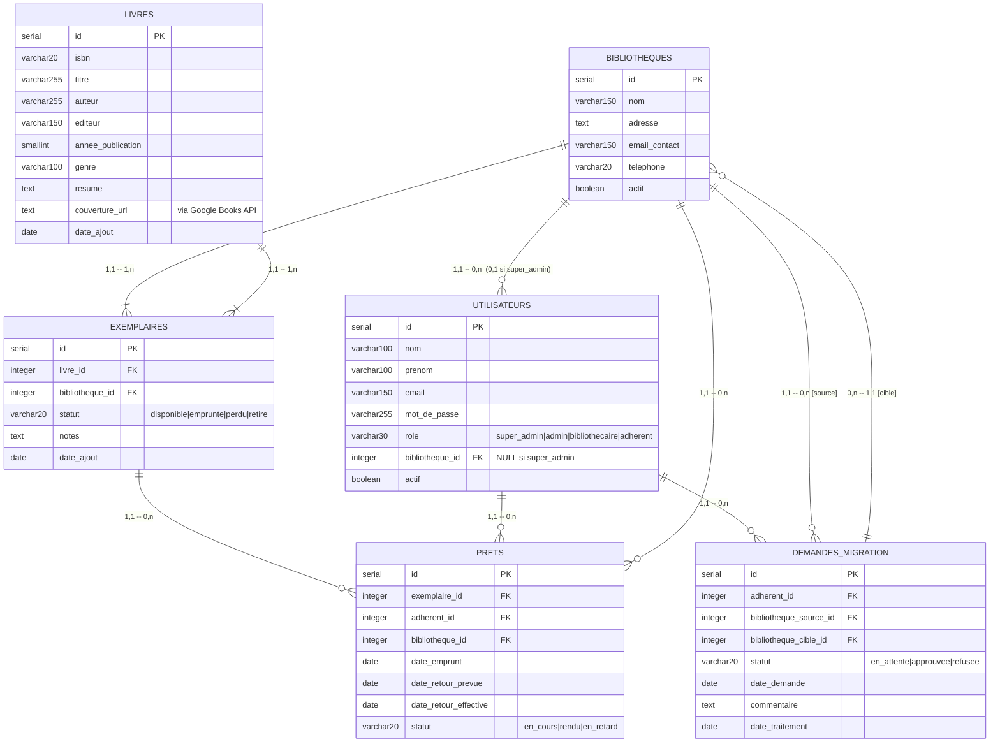

# BiblioTech – Schéma Entité-Association (MCD)

> **Rôles utilisateurs** : `super_admin` (global, sans bibliothèque) · `admin` (gestion complète d'une bibliothèque) · `bibliothecaire` (livres et prêts) · `adherent` (self-service + migration)
>
> ⚠️ `super_admin` : `bibliotheque_id` est NULL — il n'appartient à aucune bibliothèque, d'où la cardinalité **(0,1)** côté utilisateur.

