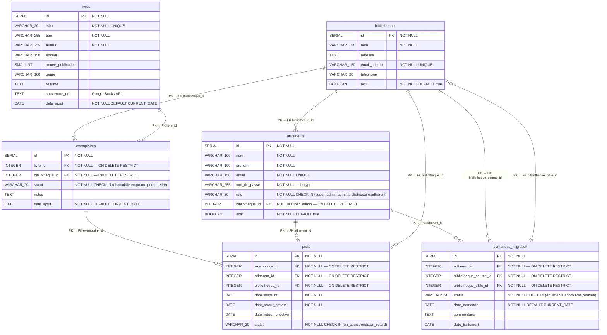

# BiblioTech – Schéma Physique des Données (MPD)

> **MPD PostgreSQL** — types physiques, contraintes et clés étrangères explicites.
> Toutes les FK ont `ON DELETE RESTRICT` sauf mention contraire.

